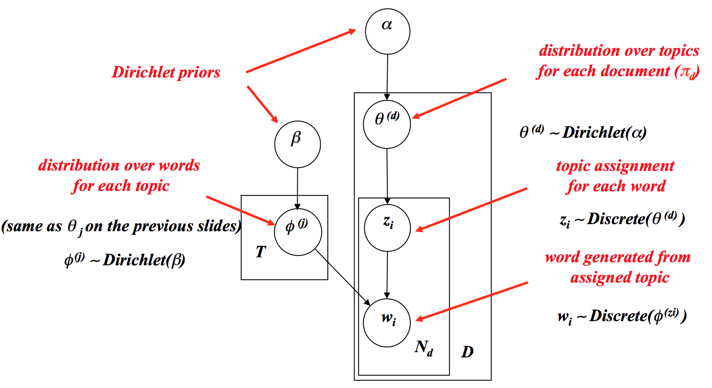

# Latent Topic Analysis

__Doris Jung-Lin Lee__

The goal of proablistic topic models is to discover latent topics in texts. Each *topic* is simply a distribution of words. 

## Probablistic Latent Semantic Analysis (PLSA, or refered to as PLSI in some texts)
Assume that words in a document D is generated by sampling words independnetly from a mixture of k topic models $p(w|\theta_i)$, the probability of generating word w in document D is the product of the probability that a topic is in the document and the probability that a word is in the topic, summing this over all possible topics.
$$p_D(w) =\sum^k_{i=1} p(i|D)p(w|\theta_i)\quad (1)$$
We know that each document is generated by drawing independently from a multinomial distribution, so the probability of the document (document likelihood) is the product over the probabilities of all words (This is simmilar to how the query likelihood model is formulated): 
$$p(D) = \prod_{w\in V} p_D(w)^{c(w,D)}$$
So taking log on both sides, we can get our log-likelihood:
$$log p(D) \sum_{w\in V} c(w,D) log p_D(w)$$
Plugging in Eq.1 we get : 
$$log p(D) =\sum_{w\in V} c(w,D) log \sum^k_{i=1} p(i|D)p(w|\theta_i)$$
Now since our data is some big corpus of text C containing multiple documents $D_1....D_{|C|}$,  we simply sum up all the log-likelihoods for each docuemnt: 
$$log p(C|\Lambda) =\sum_{D\in C}\sum_{w\in V} c(w,D) log \sum^k_{i=1} p(i|D)p(w|\theta_i)$$
- where $\Lambda$ is a set of all parameters including k switches that controls the mixture of multinomial distribution ($p(i|D)$, or sometimes written as $\pi_{d,i}$, topic selection probability for each document), we also have k unknown topics distributions .
- The goal of the EM algorithm is to solve for : 
$$\hat{\Lambda} = argmax p(C|\Lambda)$$
- But the problem with PLSA is that  there are too many parameter to estimate $\pi$ switches, so there are many local maxes where EM can be easily trapped. 
- One way that we could solve this is to impose a prior on the parameters (i.e. a higher level generative model that tells you how what the value of each parameter should be), we chose that prior to be a Dirichlet distribution.
- The Dirichlet distribution is controlled by an $\alpha$ parameter, which could be thought of as adding pseudo counts to a word to encourage that the topic $\theta_i$ assigns a higher probability to that word.
- Another problem with PLSA is that it is _not generative_, i.e. can not predict topic distribution for unseen documents. 
## Latent Dirchlet Allocation (LDA):
- LDA resolves both of these problems : 
	- generative model where each new document can be generated by drawing from the Dirichlet with our trained parameters
	- because the Dirchlet now "summarizes" our topic selection probability parameters ($\pi_d,i$), we now have less parameters (k-1 rather than 2k-1).
- At a high level, what LDA does is that it first draws from a Dirichlet distribution of topics (controlled by parameter $\alpha$) for the whole corpus. Each topic in that distribution ($\theta$) has its own word distribution for document M which is a multinomial distribution. 
- So we first pick a topic ($\theta_i$) for the document D from our topic distribution ($\sim Dir(\alpha)$). Then in order to generate the words inside the document, we pick a topic assignment for each word ($z_i$), then using the word distribution for that topic ($\sim Dir(\beta_i$)), we can then pick a word ($w_i$).

## References:
 
- Zhai,ChengXiang, Statistical Language Models for Information Retrieval (2009) pg 87-93