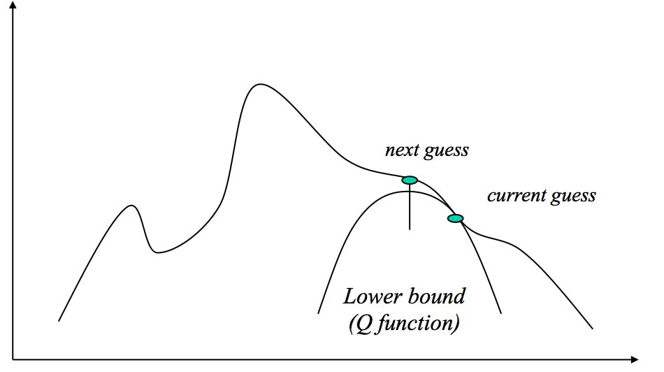

# Notes on Variational inference for Latent Dirichlet Allocation (LDA)

Doris Jung-Lin Lee

Our goal is to determine the posterior $p(\theta, z|w,\alpha,\beta)$, which is the distribution over topics and the hidden variable z. We get this as the fraction: 
$$p(\theta, z|w,\alpha,\beta)=\frac{p(\theta,z,w|\alpha,\beta)}{p(w|\alpha,\beta)}$$
There are two ways to think about this: 1) this is simply rearranging the form of chain rule $p(\theta,z,w|\alpha,\beta)=p(\theta, z|w,\alpha,\beta)p(w|\alpha,\beta)$
or 2) the denominator is the distribution where the $\theta$ and z are marginalized out (which means that we integrate over d$\theta$ and dz; since z is discrete, we can simply convert it to a summation). 
$$p(w|\alpha,\beta) =\int_\theta p(\theta|\alpha)\Bigg(\prod^N_{n=1}\sum_{z_n} p(z_n|\theta) p(w_n|z_n,\beta)\Bigg) d\theta$$

# Variational Inference

Problem:  The dependencies of $\theta$ and $\beta$ is intractable (i.e. we can not find max-likelihood analytically).

We want to get rid of the dependencies, so we modify the graphical model to ignore the dependencies on $\theta$,$z$ and $w$ (Fig. 5 Blei03). We can come up with an ad-hoc variational distribution q, which is just a lower-bound guess function that doesn't involve those dependent variables.
$$q(\theta,\vec{z}|\gamma,\phi) =q(\theta|\gamma)\prod^N_{n=1}q(z_n|\phi_n)$$
 This approximation is okay because we're only doing this per datapoint (per document), so we can be sure that every q is strictly lower than the posterior at every point. 

Note that q is used for estimating the our whole posterior $p(\theta,z,w|\alpha,\beta)$ and not just the denominator. We have free variational parameters $\phi_n$ that we can use making our q more like our posterior p, and also the Dirichlet parameter $\gamma$, which determines the topic $\theta$ drawn from (analogous to $\alpha$).

Now refering to the appendix A3, we are interestedi n the log-likelihood.
 First we expand out the distribution to join with z,w
$$log p(w|\alpha,\beta) = log \int \sum_z p(\theta,z,w|\alpha,\beta)$$
Then to introduce our variational distribution, we multiply by q/q : 
$$log p(w|\alpha,\beta) = log \int \sum_z \frac{p(\theta,z,w|\alpha,\beta)q(\theta,\vec{z})}{q(\theta,\vec{z})}$$

<!--In the continous case,: 
$$\int _{\Omega }\phi \circ g\,d\mu\geq \phi \left(\int _{\Omega }g\,d\mu \right) .$$
Here our $\phi$ is the log function, 
$$log p(w|\alpha,\beta) \geq \int_\theta \sum_z log \frac{p(\theta,z,w|\alpha,\beta)q(\theta,\vec{z})}{q(\theta,\vec{z})}$$-->

<!--We pull out the q term (this should be ok since log(f(x))< f(x) ??)
$$log p(w|\alpha,\beta) \geq \int_\theta q(\theta,\vec{z}) \sum_z log \frac{p(\theta,z,w|\alpha,\beta)}{q(\theta,\vec{z})}$$-->

<!--$$log p(w|\alpha,\beta) \geq \int_\theta  \sum_z log  q(\theta,\vec{z})p(\theta,z,w|\alpha,\beta)d\theta-\int_\theta  \sum_z q(\theta,\vec{z})logq(\theta,\vec{z})d\theta$$
-->

Expectation Value of a probability distribution is typically defined as : $$\operatorname {E} [X]=\int x f(x)\,\mathrm {d} x.$$ We can rewrite the above equation as an expectation over q of the distribution p/q:
$$log p(w|\alpha,\beta) = log \overbrace{\Bigg[\int \sum_z q(\theta,\vec{z}) \frac{p(\theta,z,w|\alpha,\beta)}{q(\theta,\vec{z})}\Bigg]}^{E_q\big[ \frac{p(\theta,z,w|\alpha,\beta)}{q(\theta,\vec{z}}\big]}$$
$$=log \sum_Z E_q\big[ \frac{p(\theta,z,w|\alpha,\beta)}{q(\theta,\vec{z}}\big]$$

Based on Wikipedia, Jensen's inequality states that if $\phi$ is convex:
$$\mathbb {E} \left[\phi (X)\right] \geq \phi \left(\mathbb {E} [X]\right).$$
But we know that our function q must be concave, since it is a lower bound to our true function (see Fig above). So Jensen's inequality is actually flipped around than the definition above: given that $\phi$ is concave, 
$$\mathbb {E} \left[\phi (X)\right] \leq \phi \left(\mathbb {E} [X]\right).$$ 
Note: This derivation insight came from the SVI paper [(Hoffman13, pg.1311)](http://www.columbia.edu/~jwp2128/Papers/HoffmanBleiWangPaisley2013.pdf)

$$log p(w|\alpha,\beta) \geq E_q\Big[ log \sum_Z \frac{p(\theta,z,w|\alpha,\beta)}{q(\theta,\vec{z})}\Big]$$

$$\boxed{log p(w|\alpha,\beta) \geq E_q\Big[ log  p(\theta,z,w|\alpha,\beta)\Big]-E_q\Big[log q(\theta,\vec{z})\Big]}\quad \quad (12)$$

The right hand side of Eq.12 is often known as ELBO (evidence lower bound).  
$$L = \mathrm{ELBO} =  E_q\Big[ log \sum_Z \frac{p(\theta,z,w|\alpha,\beta)}{q(\theta,\vec{z})}\Big]$$
Given the definition of KL divergence D, it is easy to rearrange the log-expectation and show that it is composed of the difference between log-expectation, or difference between cross entropy and entropy of p and pq. 
$$D(q||p) = log p(w|\alpha,\beta)- E_q\Big[ log \sum_Z \frac{p(\theta,z,w|\alpha,\beta)}{q(\theta,\vec{z})}\Big]$$
$$log p(w|\alpha,\beta)=L(\gamma,\phi;\alpha,\beta)+D(q||p)$$
So minimizing the KL divergence is equivalent to maximizing the ELBO plus an additive constant that does not depend on q.
$$D(q||p)=-ELBO+log p(w|\alpha,\beta)$$
Now we want to expand our lower bound L by factorizing. Here, factorizing means converting the joint distribution on multiple variables into a product of one less variable joint distribution multiplied by its conditional. Its more clearly stated by applying the chain rule onto the first term in Eq. 12: 
$$p(\theta,z,w|\alpha,\beta)=p(z,w|\alpha,\beta)p(\theta|\alpha,\beta)$$
$\theta$ does not depend on $\beta$.
$$=p(z,w|\alpha,\beta)p(\theta|\alpha,\beta)$$
Expanding the joint of z,w again
$$=p(w|z,\alpha,\beta)p(z|\theta,\alpha,\beta)p(\theta|\alpha)$$
z does not depend on $\alpha$ and $\beta$; w does not depend on $\theta,\alpha$.
$$=p(w|z,\theta,\alpha,\beta)p(z|\theta)p(\theta|\alpha)$$
We do the same for the second term. Note the trick to determine what depends on what, and what dependency we could drop is to look at the graphical model in Fig. 5. If there is no direct connection between two nodes, then we can drop it, intermediate dependencies are accounted for in the conditional that we multiply in by chain rule. For example, there is no direct connection between $\alpha$ and z, so that's why we were able to simplify the p(z|...) term. 

So finally our lower bound is now:
$$L(\gamma,\phi;\alpha,\beta) = E_q[log p(\theta|\alpha)]+E_q[log p(z|\theta)]+E_q[log p(w|z,\beta)]$$
$$-E_q[log q(\theta)]-E_q[log q(z)]$$
Note from Eq.12 to 14 and from Eq.14 to Eq. 15, they start doing this thing where each term when expanded is place into each independent line for clarity. 
Now all we have to do is plug in the Dirchlet distribution and use this special equation in Appendix A.1 : $E_q[log\theta_i|\gamma]=\Psi(\alpha_i) - \Psi(\sum\alpha_i) $ (not that this is the conditional expectation, no p(..))

At a high level, Appendix A.3.1 and A.3.2 simply tries to come up with an objective function (Lagrangian) that we are trying to maximize, then we take the gradient and obtain the update equation for 1) the variational parameter $\phi$ (using the multinomial distribution) and 2) the Dirichlet parameter $\gamma$ (using the Dirichlet distribution)
If you are familiar with gradient descent, this is like finding a cost function J and then doing parameter update $\alpha_{i+1} \leftarrow \alpha_i +\epsilon \frac{\partial J}{\partial\theta}$. This is how we get at Eq. 6 and 7. 

These update equations for the parameters are used in the EM algorithm (called variational EM, because we are doing EM on the variational distribution q). 

$$ \phi_{ni} \propto \beta_{i,w_n} exp(E_q[log\theta_i|\gamma])$$
$$\gamma_i = \alpha_i +\sum^N_{n=1} \phi_{ni}$$

(Note that we got the conditional expectation from rearranging our lower bound and applying 
$E_q[log\theta_i|\gamma]=\Psi(\alpha_i) - \Psi(\sum\alpha_i) $) We don't exactly understand "intuitive interpretation" of Eq. 6 and 7 paragraphs. But the idea is vaguely that we could get from Bayes rule the Bayesian update: 
$$p(z_n,w_n)\propto p(w_n|z_n)p(z_n)$$
$$p(w_n|z_n)=\beta$$

It is important to note that the max-likelihood parameters $\gamma$ and $\phi$ are optimized for __per-document__ ($\vec{w}$, i.e. approximating a q at every datapoint), so we need to run the EM algorithm N times. Each EM iteration requires O((N+1)k). 

Now that we have a way to get $\gamma^*$ and $\phi^*$ per document, in the final section (5.3), we want to now figure out a way to apply this to a whole corpus $D = \{ w_1...w_n\}$. The whole goal of this excercise is that we know how to find the optimized values for the variational parameters for our lower-bound surrogate q function, but now we want to get at the __empirical Bayes estimate__ for the real parameters $\alpha$ and $\beta$ for our LDA model that we really care about.

Looking inside Appendix A4, we can again see how to get the update equation by using Lagrange multiplier. Now since we are updating $\alpha$ and $\beta$, we take our derivative with respect to that to get the update equations. There is a slight interesting subtlety with the Dirichelt update w.r.t alpha, apparently it can't be solved analytically. So we have to use Newton's method to compute the optimal model parameter, which is expensive $O(n^3)$. But thankfully, because our Hessian (which is composed of $\partial L/\partial\alpha_i\alpha_j$) is of a special form (diagonal+constant; see A2), so we could solve this in linear time.

Now, given that we know how to update the model parameters, our EM algorithm looks like this: 
 
 - E-step : Find optimizing variational parameter ($\gamma^*$ and $\phi^*$) for each document.

 - M-step : Maximize log-likelihood w.r.t model parameter ($\alpha$ and $\beta$) by plugging in the the optimized variational parameter. As we derived in A4, this corresponds to updating the $\alpha$ via the special form using Newton's method numerically, and for $\beta$: 
 $$\beta \propto \sum_{d=1}^M \sum_{n=1}^{N_d}\phi^*_{dni} w_{dn}^j$$
 
###References: 

- The original LDA paper most of the section numbers in this note refers to. ([link](https://www.cs.princeton.edu/~blei/papers/BleiNgJordan2003.pdf))
- Very comprehensive derivation of almost every single step of math in this paper, but doesn't really give a lot of added intuition ([link](http://www.cis.jhu.edu/~xye/papers_and_ppts/ppts/LDA_study_notes_Xugang.pdf))

- Zhai(2009) Statistical Language Models for Information Retrieval page 93 has a very nice summary of how this whole inference process works at a high level.

- A comprehensive document summarizing inference methods for LDA(including variational, Gibbs, SVI and variants) ([link](http://times.cs.uiuc.edu/course/598f16/notes/lda-survey.pdf))

<!--
$$\int_\theta  \sum_z log  q(\theta,\vec{z})p(\theta,z,w|\alpha,\beta)d\theta-\int_\theta  \sum_z q(\theta,\vec{z})logq(\theta,\vec{z})d\theta$$
$$ = \operatorname {E}[log p(\theta,z,w|\alpha,\beta)] -\operatorname {E}[log p(\theta|z)]$$-->